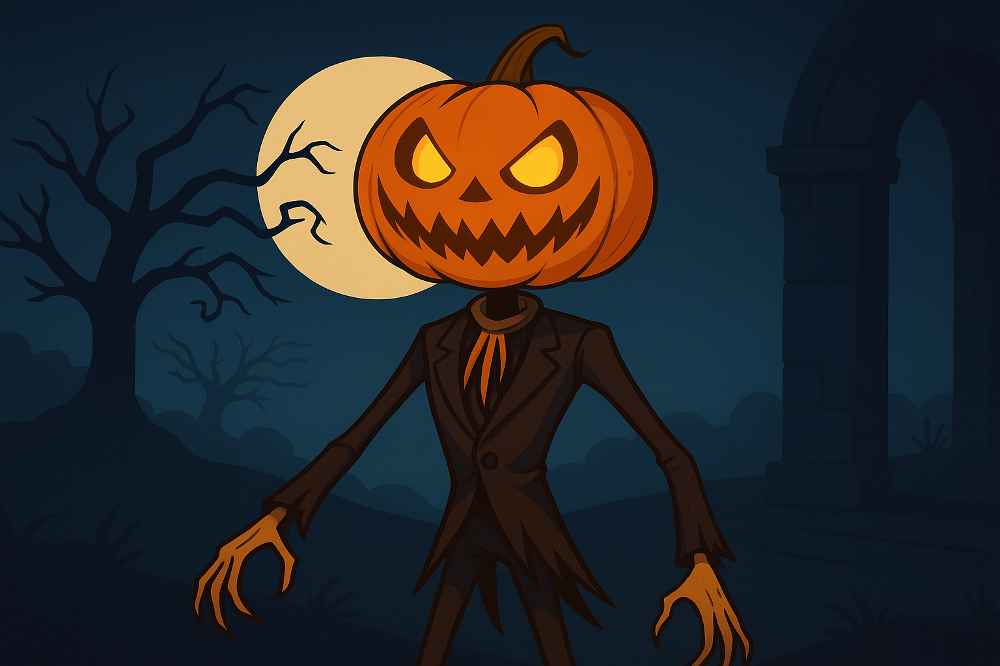
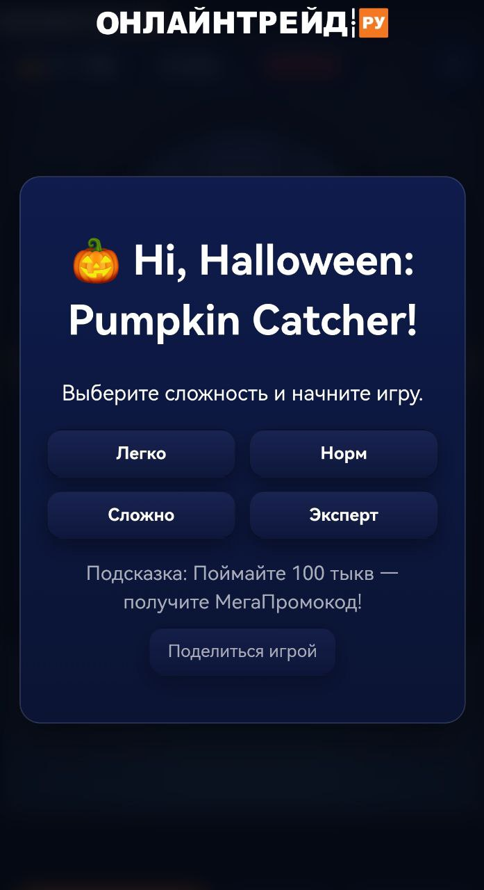
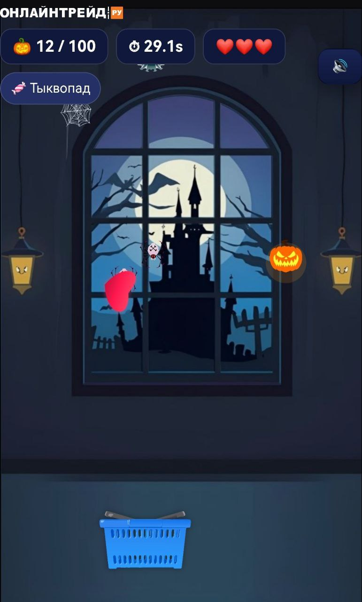
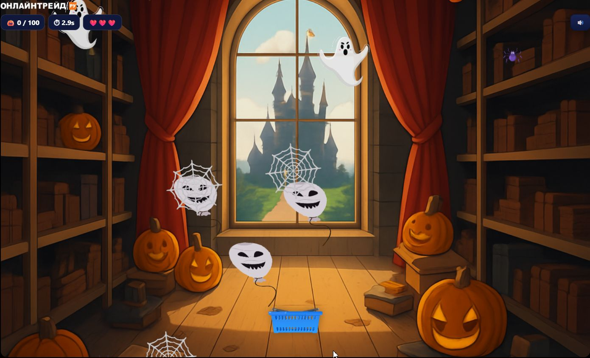
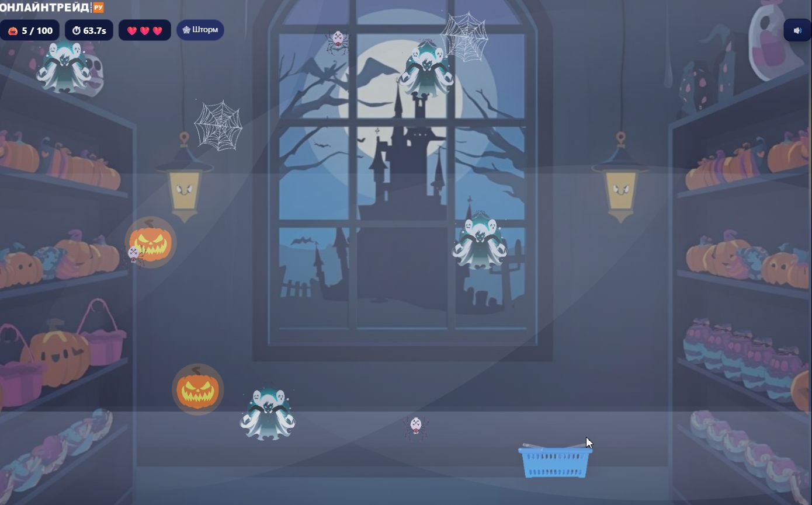

 ⭐️ <b>Понравилась игра?</b>  
  Поддержите проект — поставьте звёздочку в репозитории!  
   
  

---

# 🎃 Hi, Halloween: Pumpkin Catcher! — мини-игра  

> _👻 Праздничная HTML5-игра к Хэллоуину от **ОНЛАЙНТРЕЙД.РУ** — ловите тыквы и конфеты прямо в браузере!_  

Мини-игра к Хэллоуину от **ОНЛАЙНТРЕЙД.РУ**.  
Лёгкая, атмосферная и весёлая HTML5-игра прямо в браузере.  
Ваша цель проста: **ловите тыквы и конфеты**, избегайте **пауков, паутины и привидений**.  
Соберите **100 🎃** — и Джек откроет секретную награду!  

👉 [Играть в Hi Halloween](https://annyaromanova-del.github.io/Hi-Halloween-Pumpkin-Catcher-/)  

---

## 🕹 Управление  

- 📱 **На телефоне:** водите корзину пальцем по экрану.  
- 🖥 **На компьютере:** двигайте корзину мышкой.  

---

## 📸 Скриншоты  

  
   🏠 Кадр из заставки к игре

  
  
   👻 Мобильный интерфейс и экран с Джеком

  
  
   ❄️ Дневная и ночная «Айс»-версии игры

---

## ⚡ Технологии  

- **HTML5 Canvas**  
- **Vanilla JavaScript** (без фреймворков)  
- **GitHub Pages** — публикация и хостинг  

---

## 💼 Брендирование  

Проект создан как праздничная мини-игра для компании **ОНЛАЙНТРЕЙД.РУ**.  
Логотип используется исключительно в рамках брендированной версии игры и не подлежит изменению или удалению.  
Визуальный стиль, персонажи и элементы интерфейса являются частью фирменного дизайна.  

---

## 📜 Лицензия  

Игра **🎃 Hi, Halloween: Pumpkin Catcher!** распространяется по лицензии  
**[Creative Commons Attribution-NonCommercial-NoDerivatives 4.0 International (CC BY-NC-ND 4.0)](https://creativecommons.org/licenses/by-nc-nd/4.0/)**  

Это означает:  
- можно делиться игрой и ссылками на неё;  
- нельзя изменять дизайн, убирать логотип **ОНЛАЙНТРЕЙД.РУ** или использовать игру в коммерческих целях;  
- при публикации необходимо сохранять имя автора и ссылку на источник.  

© 2025 **Анна Романова / Онлайнтрейд.ру**  
🎮 Мини-игра к Хэллоуину. Лови тыквы и конфеты, избегай пауков и привидений!

---

## ✨ Обновления  

**🕐 20 октября 2025 — версия 1.2**  
- Добавлен новый игровой режим **«🎃 Тыквотряс (Pumpkin Quake)»** — земля ходит ходуном, а Джек проверяет вашу реакцию!  
- Улучшена адаптация под мобильные устройства.  
- Обновлены визуальные эффекты и анимации падения предметов.  
- Добавлены новые праздничные саундэффекты.  
- Повышена производительность и плавность рендеринга Canvas.  

---

> _Разработано с любовью и магией Хэллоуина 💫_  
> _by **Анна Романова** для **ОНЛАЙНТРЕЙД.РУ**_
